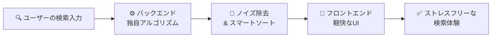
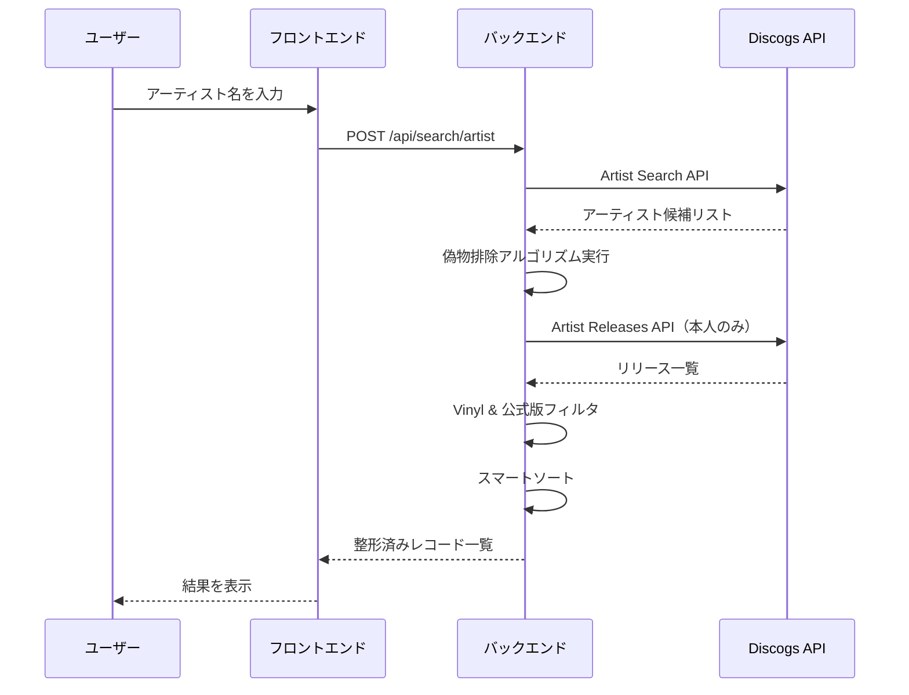
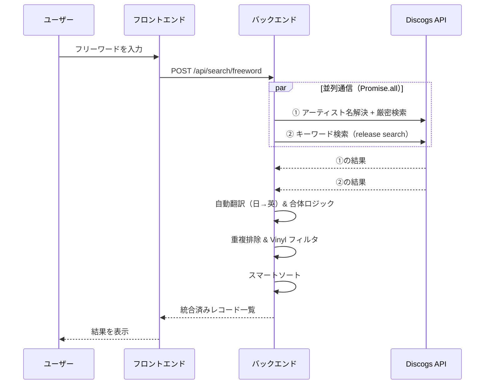
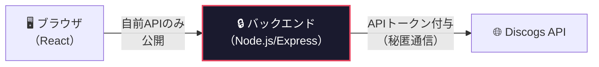
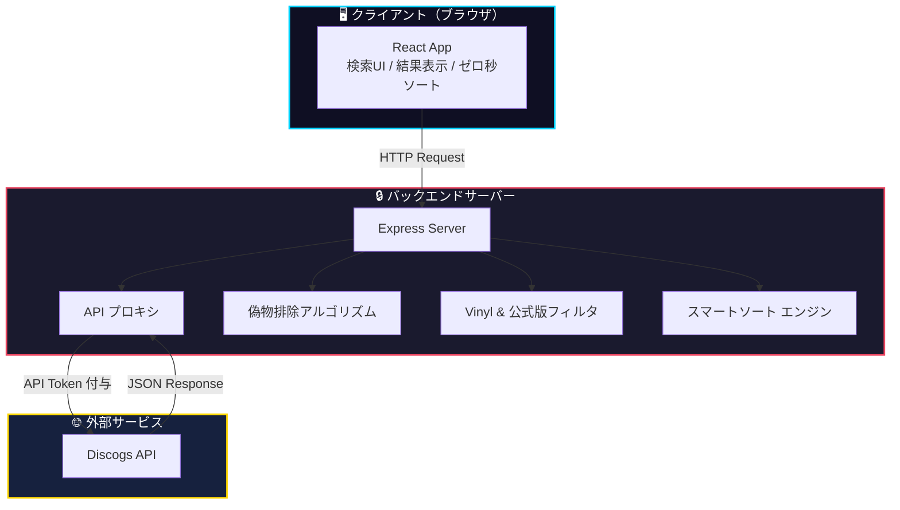

# 📀 VinylQuery — 要件定義書

> **アナログレコード専用検索アプリケーション**
> Version 1.0 ｜ 作成日: 2026-05-06

---

## 目次

1. [プロジェクト概要](#1-プロジェクト概要)
2. [開発の背景と解決する課題](#2-開発の背景と解決する課題)
3. [ターゲットユーザー](#3-ターゲットユーザー)
4. [機能要件](#4-機能要件)
5. [非機能要件](#5-非機能要件)
6. [システム構成（技術スタック）](#6-システム構成技術スタック)
7. [画面構成・UI仕様](#7-画面構成ui仕様)
8. [API設計](#8-api設計)
9. [用語集](#9-用語集)

---

## 1. プロジェクト概要

**VinylQuery** は、世界最大の音楽データベース **Discogs** の API を活用し、**純粋な「公式のアナログレコード（Vinyl）」** だけを直感的かつノイズレスに検索できる Web アプリケーションである。

複雑な仕様を持つ本家サイトの検索機能を裏側で最適化し、日本の音楽ファンやレコードコレクターが **ストレスなく目的の作品にたどり着ける体験** を提供する。

> [!IMPORTANT]
> 本アプリは Discogs の公式アプリではなく、Discogs API を利用した **独立した第三者アプリケーション** である。

---

## 2. 開発の背景と解決する課題

### 2.1 現状の課題

既存の音楽データベース（Discogs 等）には、以下の **3つの根本的な課題** が存在する。

| # | 課題名 | 詳細 | 影響 |
|---|--------|------|------|
| 1 | **ノイズの多さ** | 検索結果に CD・カセット・デジタル配信・海賊版（ブートレグ）、さらには同名の bot やトリビュートバンドが大量に混入する | 目的のレコードを見つけるまでに膨大な時間がかかる |
| 2 | **言語の壁（表記揺れ）** | データベース上は英語（例: `Gen Hoshino`）で登録されていることが多く、日本語（例: `星野源`）で検索すると本人の作品が大量に検索漏れを起こす | 日本のユーザーが正しい検索結果を得られない |
| 3 | **関連作品の埋没** | ゲスト参加しただけの楽曲が上位に表示され、本人のメイン作品が下位に押し出される | 本当に欲しい作品へのアクセスが困難になる |

### 2.2 解決アプローチ



**バックエンドでの独自アルゴリズム** と **フロントエンドでの軽快な UI** を組み合わせることで、上記 3 つの課題を同時に解決する。

---

## 3. ターゲットユーザー

| ペルソナ | 説明 | 主な利用シーン |
|----------|------|----------------|
| 🎧 **レコードコレクター** | アナログレコードを収集しているコレクターや DJ | 特定アーティストのレコード一覧を確認したい |
| 🎵 **音楽ファン** | 日本のアーティストのレコードを探している音楽ファン | 日本語で検索して海外盤・国内盤を網羅的に見つけたい |
| 😤 **Discogs ユーザー** | Discogs の複雑な検索 UI に使いにくさを感じているユーザー | もっとシンプルにレコードだけを検索したい |

---

## 4. 機能要件

### 4-A. 検索モード（2種類）

ユーザーの目的に合わせて **2つの検索アプローチ** を提供する。

---

#### 4-A-1. 🎤 アーティストから探す（厳密検索）

検索したアーティストの **「本人」を正確に特定** し、その人物の公式レコードのみを一覧表示する。



##### 偽物排除アルゴリズム

| ステップ | 処理内容 | 目的 |
|----------|----------|------|
| 1 | 名前に `bot`, `band`, `tribute` 等を含む別名義を **自動検知・減点** | 偽物・トリビュート系の排除 |
| 2 | アカウントの登録歴（**ID の若さ**）を評価 | 古くから登録されている = 本物の可能性が高い |
| 3 | 上記スコアを総合し、**「本物」だけを抽出** | 正確なアーティスト特定 |

---

#### 4-A-2. 🔎 フリーワードで探す（ハイブリッド検索）

作品名やキーワードで幅広く探す機能。



##### 自動翻訳 & 合体ロジック

| 処理 | 詳細 |
|------|------|
| **日本語→英語のアーティスト名解決** | 入力が日本語の場合、裏側で英語名に変換して検索を実行 |
| **2系統の並行 API 通信** | 「厳密なアーティスト検索」と「キーワード検索」を `Promise.all` で同時実行 |
| **結果の合体** | 両者の結果を重複なく統合し、**検索漏れを完全に防止** |

---

### 4-B. 独自フィルタリング（ノイズの徹底排除）

バックエンドの処理において、以下の条件に合致しないデータは **ユーザーに表示する前に全て破棄** する。

| フィルタ名 | 条件 | 排除対象 |
|------------|------|----------|
| **フォーマット制限** | `format = Vinyl` のみ抽出 | CD, カセット, デジタル, DVD 等 |
| **公式版制限** | `Unofficial Release` フラグを除外 | 海賊版, ブートレグ, 非公式盤 |

> [!NOTE]
> フィルタリングはすべて **バックエンド側** で実行される。フロントエンドには「クリーン」な結果のみが到達するため、ユーザーがフィルタ操作を意識する必要はない。

---

### 4-C. ユーザー向け表示・ソート機能

#### スマートソート（関連度順）— デフォルト

検索結果に対して **独自のスコアリング** を行い、ユーザーにとって最も関連性の高い順に並び替える。

| 優先度 | 条件 | スコア |
|--------|------|--------|
| **最上位** | アーティスト名が **完全一致** する作品 | 高 |
| **次点** | タイトルに検索ワードが **含まれる** 作品 | 中 |
| **下位** | 上記に該当しない（ゲスト参加等） | 低 |

#### ゼロ秒ソート（発売年順）

画面上のプルダウンで以下の切り替えが可能。**API と再通信せず、ブラウザのメモリ上で即座（ゼロ秒）に並び替える。**

| ソートオプション | 並び順 |
|------------------|--------|
| おすすめ順 | スマートソートのスコア順（デフォルト） |
| 新しい順 | 発売年の降順 |
| 古い順 | 発売年の昇順 |

---

## 5. 非機能要件

### 5.1 UI/UX デザイン

| 項目 | 仕様 |
|------|------|
| **テーマ** | モダンなダークモード（暗い部屋やクラブハウスでも見やすい配色） |
| **言語** | 日本語ナビゲーション（専門用語を極力排除） |
| **レスポンシブ** | PC / タブレット / スマートフォンに対応 |
| **アクセシビリティ** | 十分なコントラスト比、セマンティック HTML の使用 |

### 5.2 パフォーマンス

| 項目 | 仕様 |
|------|------|
| **N+1問題の回避** | リストの数だけ API を叩く設計を回避するアーキテクチャ |
| **並列通信** | ハイブリッド検索時は `Promise.all` を採用し、描画を高速化 |
| **ゼロ秒ソート** | ソート切替時は API 再通信なし（クライアントサイドで即時実行） |

### 5.3 セキュリティ

| 項目 | 仕様 |
|------|------|
| **API プロキシ構成** | フロントエンドから直接 Discogs API を叩かず、自前のバックエンド（Node.js）を経由 |
| **APIシークレットの保護** | API トークン等の機密情報はバックエンドの環境変数に保持し、クライアントに露出させない |



> [!CAUTION]
> フロントエンドのソースコードや DevTools から API トークンが **絶対に見えない** 設計とすること。

---

## 6. システム構成（技術スタック）

### 6.1 技術スタック一覧

| レイヤー | 技術 | 選定理由 |
|----------|------|----------|
| **フロントエンド** | React | モダンなコンポーネント設計、非同期通信制御に強い |
| **バックエンド** | Node.js / Express | API プロキシ、データ整形、スマートソート処理に最適 |
| **外部 API** | Discogs API | Database Search / Artists エンドポイントを利用 |
| **ビルドツール** | Vite | 高速な開発サーバーと最適化ビルド |

### 6.2 全体アーキテクチャ



### 6.3 ディレクトリ構成（想定）

```
vinylquery/
├── client/                    # フロントエンド（React + Vite）
│   ├── public/
│   ├── src/
│   │   ├── components/        # UIコンポーネント
│   │   │   ├── SearchBar.jsx
│   │   │   ├── SearchModeToggle.jsx
│   │   │   ├── ResultCard.jsx
│   │   │   ├── ResultList.jsx
│   │   │   └── SortDropdown.jsx
│   │   ├── pages/
│   │   │   └── Home.jsx
│   │   ├── hooks/             # カスタムフック
│   │   │   └── useSearch.js
│   │   ├── utils/             # ユーティリティ
│   │   ├── App.jsx
│   │   ├── App.css
│   │   ├── index.css
│   │   └── main.jsx
│   ├── index.html
│   ├── vite.config.js
│   └── package.json
│
├── server/                    # バックエンド（Node.js / Express）
│   ├── routes/
│   │   └── search.js          # 検索APIルート
│   ├── services/
│   │   ├── discogs.js         # Discogs API通信
│   │   ├── filter.js          # フィルタリングロジック
│   │   ├── scoring.js         # スマートソート/スコアリング
│   │   └── translate.js       # 日→英 翻訳処理
│   ├── middleware/
│   │   └── errorHandler.js
│   ├── server.js              # Expressエントリーポイント
│   ├── .env                   # 環境変数（API トークン等）
│   └── package.json
│
├── .gitignore
└── README.md
```

---

## 7. 画面構成・UI仕様

### 7.1 画面一覧

本アプリは **シングルページアプリケーション（SPA）** として構成される。

| 画面 | 説明 |
|------|------|
| **メイン画面** | 検索バー + 検索モード切替 + 結果一覧 + ソート切替 |

### 7.2 UI 要素の詳細

#### 検索バー

| 項目 | 仕様 |
|------|------|
| 位置 | 画面上部の中央 |
| プレースホルダー | 選択中のモードに応じて動的に変化 |
| 入力方式 | テキスト入力 + 検索ボタン / Enter キー |

#### 検索モード切替

| 項目 | 仕様 |
|------|------|
| UI形式 | トグルボタン or タブ |
| 選択肢 | 「🎤 アーティストから探す」 / 「🔎 フリーワードで探す」 |
| デフォルト | アーティストから探す |

#### 結果カード（1件あたり）

| 表示項目 | データソース |
|----------|-------------|
| ジャケット画像 | `cover_image` / `thumb` |
| タイトル | `title` |
| アーティスト名 | `artist` |
| レーベル | `label` |
| 発売年 | `year` |
| フォーマット詳細 | `format`（例: LP, 7", 12"） |

#### ソートプルダウン

| 項目 | 仕様 |
|------|------|
| 位置 | 結果一覧の上部 |
| 選択肢 | おすすめ順 / 新しい順 / 古い順 |
| 動作 | クライアントサイドで即時ソート（API 再通信なし） |

---

## 8. API設計

### 8.1 内部 API エンドポイント（バックエンド）

#### `POST /api/search/artist`

アーティスト名による厳密検索を行う。

**リクエスト:**
```json
{
  "query": "星野源"
}
```

**レスポンス:**
```json
{
  "artist": {
    "id": 3456789,
    "name": "Gen Hoshino",
    "realname": "源 星野"
  },
  "results": [
    {
      "id": 12345678,
      "title": "Yellow Dancer",
      "year": 2015,
      "label": "Speedstar Records",
      "format": "LP",
      "cover_image": "https://...",
      "relevance_score": 100
    }
  ],
  "total": 5
}
```

---

#### `POST /api/search/freeword`

フリーワードによるハイブリッド検索を行う。

**リクエスト:**
```json
{
  "query": "Yellow Dancer"
}
```

**レスポンス:**
```json
{
  "results": [
    {
      "id": 12345678,
      "title": "Yellow Dancer",
      "artist": "Gen Hoshino",
      "year": 2015,
      "label": "Speedstar Records",
      "format": "LP",
      "cover_image": "https://...",
      "relevance_score": 95
    }
  ],
  "total": 12
}
```

### 8.2 利用する Discogs API エンドポイント

| エンドポイント | 用途 |
|----------------|------|
| `GET /database/search` | アーティスト / リリースの検索 |
| `GET /artists/{id}` | アーティスト詳細情報の取得 |
| `GET /artists/{id}/releases` | アーティストのリリース一覧取得 |

> [!NOTE]
> Discogs API のレートリミットは **認証済みリクエストで 60 req/min** である。バックエンド側で適切なレート制御を実装すること。

---

## 9. 用語集

| 用語 | 説明 |
|------|------|
| **Vinyl** | アナログレコード。本アプリが対象とする唯一のフォーマット |
| **Discogs** | 世界最大の音楽データベース・マーケットプレイス |
| **ブートレグ** | 非公式に製造・販売された海賊版レコード |
| **N+1問題** | リスト内の各アイテムに対して個別に API 通信を行ってしまう非効率な設計パターン |
| **スマートソート** | 本アプリ独自の関連度スコアリングによるソート |
| **ゼロ秒ソート** | API 再通信なしでクライアント側で即座に実行するソート |
| **ハイブリッド検索** | アーティスト検索とキーワード検索を並行実行し、結果を統合する検索方式 |
| **API プロキシ** | バックエンドが外部 API への通信を中継する構成。セキュリティのために採用 |

---

> **📋 改訂履歴**
>
> | バージョン | 日付 | 内容 |
> |------------|------|------|
> | 1.0 | 2026-05-06 | 初版作成 |
